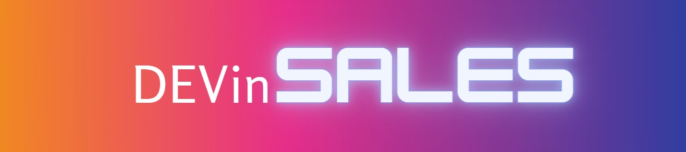
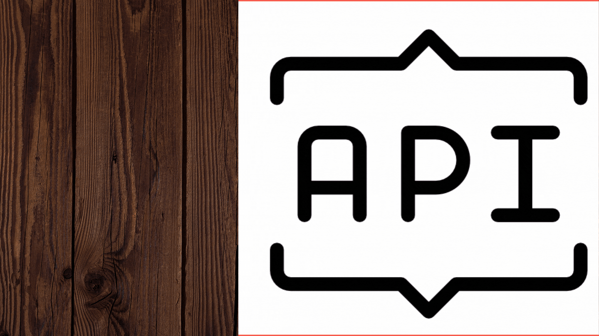
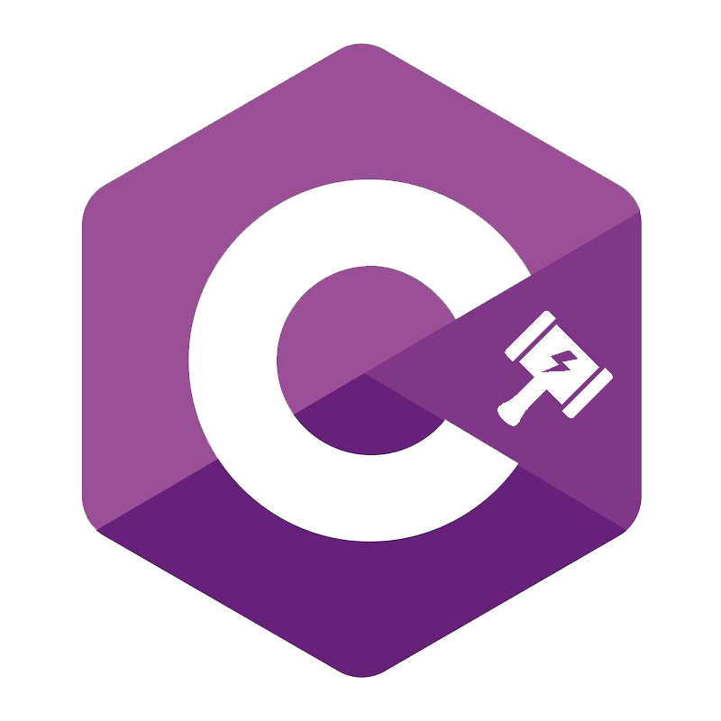

<h1 align="center">
   
</h1>

<h1 align="center">
   <p>DEVinSales - API RESTful de Vendas</p>
</h1>

<h4 align="center"> 
	🚧  Projeto em desenvolvimento 🚧
</h4>

<br>

<p align="center">
 <a href="#-sobre-o-projeto">Sobre</a> •
 <a href="#-funcionalidades">Funcionalidades</a> •
 <a href="#-como-executar-o-projeto">Como executar</a> • 
 <a href="#-tecnologias">Tecnologias</a> • 
 <a href="#-contribuidores">Contribuidores</a> • 
 <a href="#-autores">Autores</a> •  
</p>
<br>

## 💻 Sobre o projeto

O projeto trata-se de uma API desenvolvida em .NET Core 6 com Entity Framework, que segue o padrão RESTful, para um sistema de vendas, apresentando os módulos de Cadastro, Vendas, Geo-Posicionamento e Fretes.

<br>

## ⚙️ Funcionalidades

Empresas poderão fazer cadastro de vendas de produtos, preço e endereço:

- User
- Profile
- Product
- Category
- Address
- Order
- Delivery
- State
- City
- Shipping Company

<br>

## 🚀 Como executar o projeto

Este projeto é uma aplicação web em Backend.

### Pré-requisitos

Para rodar o projeto em sua máquina, você vai precisar ter instalado as seguintes ferramentas:
[Git](https://git-scm.com) e [.NET 6.0](https://dotnet.microsoft.com/en-us/download/dotnet/6.0).
Além disto é importante ter um editor para trabalhar com o código, como [VisualStudio](https://visualstudio.microsoft.com/) e um sistema gerenciador de Banco de dados relacional, como o [SQLServer](https://www.microsoft.com/pt-br/sql-server/sql-server-downloads).

#### 🎲 Rodando a Aplicação

<ol start="1">
<li>No repositório do GitHub, clone o projeto 👇</li>

```bash
# Clone este repositório
$ git clone https://github.com/DEVin-Softplan/M2P2-DEVinSales.git
```

<li>Abra o projeto no VisualStudio, clicando 2x no arquivo <b style="color:#7b9eeb">DevInSales.sln</b></li>
<br>
<li>Vá para o arquivo <b style="color:#7b9eeb">appsettings.json</b> e adicione a ConnectionString, seguindo o modelo abaixo 👇<br>

```bash
"ConnectionStrings": {
  "ServerConnection": "Server=YOURSERVER\\SQLEXPRESS;Database=DEVinSales;Trusted_Connection=True;"
  }
```

</li>

<li>Instale as seguintes dependências, via NuGet:</li>
<ul>
<li>Microsoft.EntityFrameworkCore</li>
<li>Microsoft.EntityFrameworkCore.Tools</li>
<li>Microsoft.EntityFrameworkCore.Design</li>
<li>Microsoft.EntityFrameworkCore.SqlServer</li>
<li>Swashbuckle.AspNetCore</li>
</ul><br>

<li>Com os pacotes instalados, abra o console do gerenciador de pacotes e digite o comando abaixo 👇</li>

```bash
Add-Migration InitialCreate
```

<li>Após o comando executado, você irá inserir as tabelas no Banco de Dados com o seguinte comando 👇</li>

```bash
Update-Database
```

<li>Com esses passos executados, você já pode executar a aplicação, com o <b style="color:#7b9eeb">F5</b>, que abrirá a aplicação no Swagger.</li>
</ol><br>

## 🛠 Tecnologias

As seguintes ferramentas foram usadas na construção do projeto:

<div style="display: inline_block" align="center">


</div><br>

## 👨‍💻 Contribuidores

💜 Muito obrigada para essa turma incrível que fez esse projeto tomar forma e sair do papel 👏

<b style="color:#7b9eeb">Squad 01 - DotinhoDaNet</b>

<table>
   <tr>
      <td align="center">
         <br />
         <sub><b>Narriman Lima</b></sub>
         <br/>
      </td>
      <td align="center">
         <br />
         <sub><b>Laci Leal</b></sub>
         <br/>
      </td>
      <td align="center">
         <br />
         <sub><b>Romulo Ladeira</b></sub>
         <br/>
      </td>
      <td align="center">
         <br />
         <sub><b>Matheus Moreira</b></sub>
         <br/>
      </td>
      <td align="center">
         <br />
         <sub><b>Vagner Alves</b></sub>
         <br/>
      </td>
   </tr>
</table>

<b style="color:#7b9eeb">Squad 02 - IPAAPI</b>

<table>
   <tr>
      <td align="center">
         <br />
         <sub><b>Veroni Júnior</b></sub>
         <br/>
      </td>
      <td align="center">
         <br />
         <sub><b>Erivan Oliveira</b></sub>
         <br/>
      </td>
      <td align="center">
         <br />
         <sub><b>Federico Zighue</b></sub>
         <br/>
      </td>
      <td align="center">
         <br />
         <sub><b>Rodrigo Schwedersky</b></sub>
         <br/>
      </td>
      <td align="center">
         <br />
         <sub><b>Victor Higa</b></sub>
         <br/>
      </td>
            <td align="center">
         <br />
         <sub><b>Gabriel Cordeiro</b></sub>
         <br/>
      </td>
            <td align="center">
         <br />
         <sub><b>Vinicius Rosa</b></sub>
         <br/>
      </td>
   </tr>
</table>

<b style="color:#7b9eeb">Squad 03 - CTHOR</b>

<table>
   <tr>
      <td align="center">
         <br />
         <sub><b>Guilherme Veiga</b></sub>
         <br/>
      </td>
      <td align="center">
         <br />
         <sub><b>Vinicius Souza</b></sub>
         <br/>
      </td>
      <td align="center">
         <br />
         <sub><b>Guilherme Severo</b></sub>
         <br/>
      </td>
      <td align="center">
         <br />
         <sub><b>Camila Kunitz</b></sub>
         <br/>
      </td>
      <td align="center">
         <br />
         <sub><b>Ramon Telles</b></sub>
         <br/>
      </td>
	<td align="center">
         <br />
         <sub><b>Bruno Machado</b></sub>
         <br/>
      </td>
   </tr>
</table>

<b style="color:#7b9eeb">Squad 04 - ROMEU</b>

<table>
   <tr>
      <td align="center">
         <br />
         <sub><b>Douglas Nascimento</b></sub>
         <br/>
      </td>
      <td align="center">
         <br />
         <sub><b>Ernani Pozza</b></sub>
         <br/>
      </td>
      <td align="center">
         <br />
         <sub><b>Janine Santos</b></sub>
         <br/>
      </td>
      <td align="center">
         <br />
         <sub><b>Werik Santos</b></sub>
         <br/>
      </td>
      <td align="center">
         <br />
         <sub><b>Guilherme Cittadella</b></sub>
         <br/>
      </td>
      <td align="center">
         <br />
         <sub><b>Emanuel Lopes</b></sub>
         <br/>
      </td>
	   
   </tr>
</table>

<br>

## 🦸 Autores

<table>
   <tr>
      <td align="center">
         
         <br/>
         <sub><b>DotinhoDaNet</b></sub>
      </td>
      <td align="center">
         
         <br/>
         <sub><b>IPAAPI</b></sub>
      </td>
      <td align="center">
         
         <br/>
         <sub><b>CTHOR</b></sub>
      </td>
      <td align="center">
         
         <br/>
         <sub><b>ROMEU</b></sub>
      </td>
   </tr>
</table>
