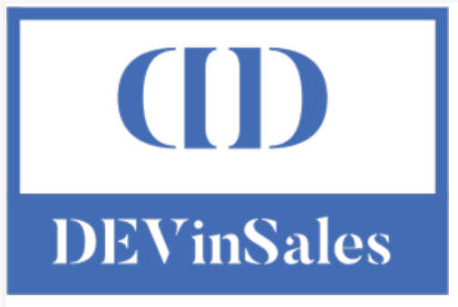
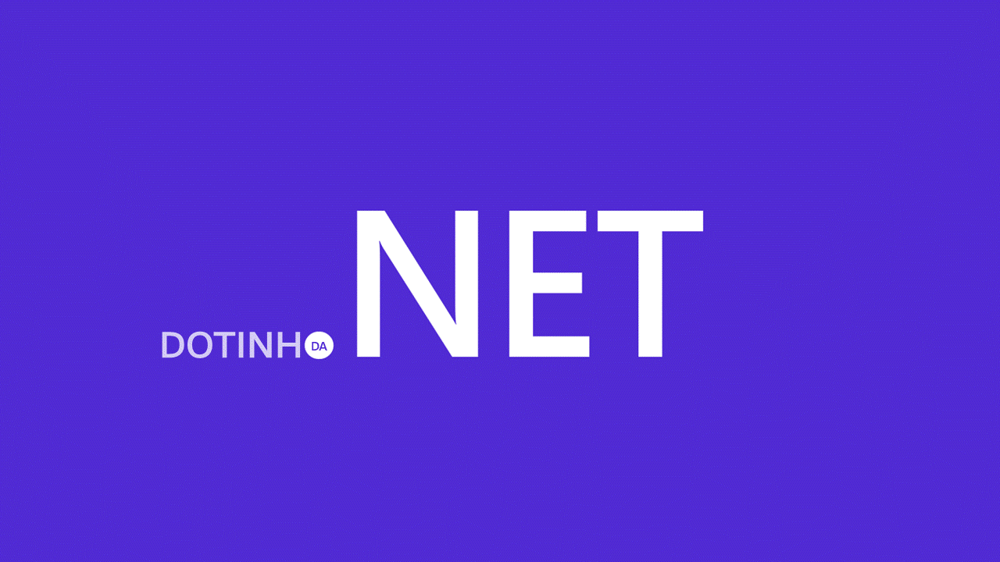

<h1 align="center">
   
</h1>

<h1 align="center">
   <p>DEVinSales - API RESTful de Vendas</p>
</h1>

<section align="center">
  
    
  <a href="https://github.com/tgmarinho/README-ecoleta/commits/master">
    
  </a>    
   
   <a href="https://github.com/tgmarinho/README-ecoleta/stargazers">
    
  </a>
</section>

<h4 align="center"> 
	🚧  Projeto em desenvolvimento 🚀 🚧
</h4>

<p align="center">
 <a href="#-sobre-o-projeto">Sobre</a> •
 <a href="#-funcionalidades">Funcionalidades</a> •
 <a href="#-como-executar-o-projeto">Como executar</a> • 
 <a href="#-tecnologias">Tecnologias</a> • 
 <a href="#-contribuidores">Contribuidores</a> • 
 <a href="#-autor">Autor</a> • 
 <a href="#user-content--licença">Licença</a>
</p>

## 💻 Sobre o projeto

O projeto trata-se de uma API desenvolvida em .NET Core 6 com Entity Framework, que segue o padrão RESTful, para um sistema de vendas, apresentando os módulos de Cadastro, Vendas, Geo-Posicionamento e Fretes.

## ⚙️ Funcionalidades

Empresas poderão fazer cadastro de vendas de produtos, preço e endereço:
  -  User
  -  Profile
  -  Product
  -  Category 
  -  Address 
  -  Order
  -  Delivery
  -  State
  -  City
  -  Shipping Company

## 🚀 Como executar o projeto

Este projeto é uma aplicação web em Backend

### Pré-requisitos

Para rodar o projeto em sua máquina, você vai precisar ter instalado as seguintes ferramentas:
[Git](https://git-scm.com) e [.NET 6.0](https://dotnet.microsoft.com/en-us/download/dotnet/6.0). 
Além disto é importante ter um editor para trabalhar com o código, como [VisualStudio](https://visualstudio.microsoft.com/) e um sistema gerenciador de Banco de dados relacional, como o [SQLServer](https://www.microsoft.com/pt-br/sql-server/sql-server-downloads).

#### 🎲 Rodando a Aplicação

<ol start="1">
<li>No repositório do GitHub, clone o projeto 👇</li>

```bash
# Clone este repositório
$ git clone https://github.com/DEVin-Softplan/M2P2-DEVinSales.git
```

<li>Abra o projeto no VisualStudio, clicando 2x no arquivo <b style="color:#7b9eeb">DevInSales.sln</b></li>
<br>
<li>Vá para o arquivo <b style="color:#7b9eeb">appsettings.json</b> e adicione a ConnectionString, seguindo o modelo abaixo:<br>

```bash
"ConnectionStrings": {
  "ServerConnection": "Server=YOURSERVER\\SQLEXPRESS;Database=DEVinSales;Trusted_Connection=True;"
  }
```
</li>


<li>Instale as seguintes dependências, via NuGet:</li>
<ul>
<li>Microsoft.EntityFrameworkCore</li>
<li>Microsoft.EntityFrameworkCore.Tools</li>
<li>Microsoft.EntityFrameworkCore.Design</li>
<li>Microsoft.EntityFrameworkCore.SqlServer</li>
<li>Swashbuckle.AspNetCore</li>
</ul><br>

<li>Com os pacotes instalados, abra o console do gerenciador de pacotes e digite o comando abaixo</li>

```bash
Add-Migration InitialCreate
```

<li>Após o comando executado, você irá inserir as tabelas no Banco de Dados com o seguinte comando:</li>

```bash
Update-Database
```

<li>Com esses passos executados, você já pode executar a aplicação, com o <b style="color:#7b9eeb">F5</b>, que abrirá a aplicação no Swagger.</li>

</ol>

## 🛠 Tecnologias

As seguintes ferramentas foram usadas na construção do projeto:
<div style="display: inline_block" align="center">


</div>

## 👨‍💻 Contribuidores

💜 Muito obrigada para essa turma incrível que fez esse projeto tomar forma e sair do papel 👏

-  Squad 01 - DotinhoDaNet
-  Squad 02 - IPAAPI
-  Squad 03 - CTHOR
-  Squad 04 - ROMEU


## 🦸 Autores
<section style="display: flex" style="justify-content: space-around">
 
 <div>
  
  <b>DotinhoDaNet</b> 
 </div>

  <div>
  
  <b>IPAAPI</b> 
 </div>

  <div>
  
  <b>CTHOR</b> 
 </div>

  <div>
  
  <b>ROMEU</b> 
 </div>

</section>

 ## 📝 Licença

Este projeto esta sobe a licença [MIT](./LICENSE).
